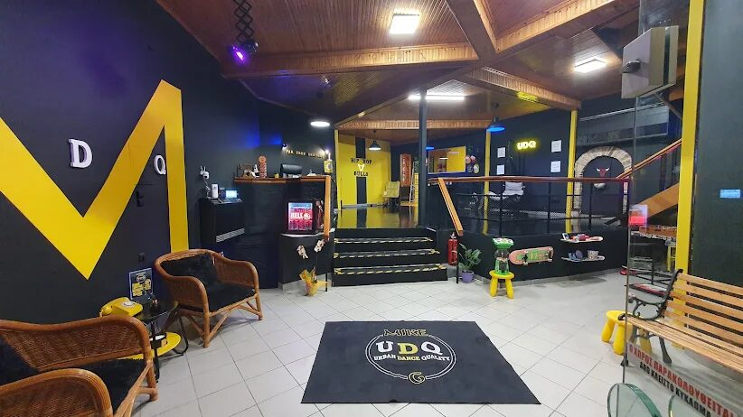
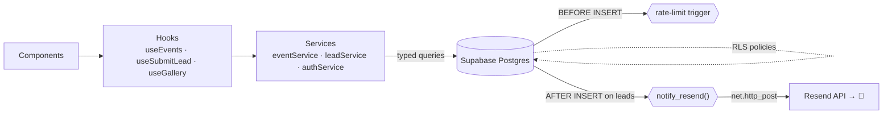

<div align="center">

# Urban Dance Quality — by Mike G

### Technical showcase of a production dance-school platform

**React 18 · TypeScript · Supabase (Postgres + RLS) · Vite · Tailwind · Vercel**

[](https://www.urbandancequality.gr/)
&nbsp;


<a href="https://www.urbandancequality.gr/"></a>

</div>

> [!NOTE]
> **Curated showcase, not the source repo.** It documents *how the platform is engineered* —
> data flow, the security model, and the interesting bits of code — for anyone reviewing the
> work. **No credentials and no verbatim application code are published here;** snippets are
> short, representative excerpts. Full source is private; the live product is linked above.

---

## Overview

A custom marketing **and** operations platform for an urban dance school in Ioannina. Two
surfaces on one codebase:

- **Public site** — animated hero reel, class catalogue, achievements, events/seminars
  timeline, media gallery, Leaflet map, and a lead-capture form.
- **Admin CMS** — a protected dashboard where the owner edits every entity (classes,
  coaches, events, achievements, gallery) and manages leads. The public site reads the
  same Postgres records the admin writes.

No custom backend server: the browser talks to Postgres through Supabase, and **the
database itself** enforces security, integrity, rate-limiting, and even sends email.

<div align="center">
<br/>



<br/>
<sub>Live UI — class tiles (Breaking · K-Pop · Competition) and gallery (performances · the space)</sub>
</div>

---

## Tech stack

| Layer | Choice | Notes |
|---|---|---|
| UI | React 18 + TypeScript | Strict types across a large component surface |
| Build | Vite 5 | `tsc -b && vite build`; admin code-split out |
| Styling | Tailwind 3 + semantic CSS-variable tokens | Roles, not hexes |
| Motion | Framer Motion | One shared preset vocabulary |
| Routing | React Router 6 | Lazy-loaded admin bundle |
| Data | Supabase — Postgres, Auth, Storage | RLS is the real authorization layer |
| Email | Resend, called from a Postgres trigger | Transactional, serverless |
| Maps | Leaflet + React-Leaflet | No API-key vendor lock-in |
| Hosting | Vercel | Git-push deploys, edge, auto HTTPS |

---

## Architecture

UI never touches the database directly. Every read/write goes **component → hook → service
→ Supabase**, and the database is the final authority on what's allowed.



```
src/
├── components/ frontend/  admin/  layout/  common/
├── services/   # DB access boundary — one module per domain, row⇄model mapping
├── hooks/      # data + derived state (useEvents, useSubmitLead, useGallery…)
├── context/    # Auth / Content / Theme providers
├── config/     # design tokens, gallery manifest, seed data
├── utils/      # validators, honeypot, formatters
├── pages/      # public pages + admin/ (lazy)
└── routes/     # AppRouter, ProtectedRoute, ScrollToTop
supabase/       # schema.sql (RLS + triggers), resend.sql, migrations
```

---

## Code highlights

### 1 · One DB client, graceful degradation
A single Supabase client for the whole app. If env vars are absent (previews, CI), services
fall back to seed data instead of crashing the build.

```ts
// lib/supabaseClient.ts
export const isSupabaseConfigured =
  Boolean(import.meta.env.VITE_SUPABASE_URL) && Boolean(import.meta.env.VITE_SUPABASE_ANON_KEY);

export const supabase = createClient(url, anonKey, {
  auth: { persistSession: true, autoRefreshToken: true },
});
```
```ts
// services/eventService.ts — the fallback in action
async getAll(): Promise<DanceEvent[]> {
  if (!isSupabaseConfigured) return SEED_EVENTS;
  const { data, error } = await supabase.from("events")
    .select("*").order("starts_at", { ascending: false });
  if (error) throw error;
  const rows = (data ?? []).map(fromRow);
  return rows.length ? rows : SEED_EVENTS;
}
```

### 2 · Services own the DB⇄model boundary
Postgres speaks `snake_case`; the app speaks `camelCase`. Two pure mappers per domain keep
that translation in exactly one place, so components only ever see clean typed models.

```ts
// services/eventService.ts
function fromRow(r: any): DanceEvent {
  return { id: r.id, title: r.title, startsAt: r.starts_at,
           coverUrl: r.cover_url, resultNote: r.result_note,
           published: r.published ?? true /* … */ };
}
function toRow(e: Partial<DanceEvent>): any {
  const row: any = {};
  if (e.startsAt !== undefined) row.starts_at = e.startsAt;   // only touch provided keys
  if (e.coverUrl !== undefined) row.cover_url = e.coverUrl;   // → partial updates stay partial
  /* … */ return row;
}
```

### 3 · Hooks hold the data logic, not the UI
Deriving "upcoming vs past", or splitting seminars from competition results, is *data*
logic — so it lives in the hook and is memoized. Components just render the arrays.

```ts
// hooks/useEvents.ts
const seminars = useMemo(() => visible.filter((e) => !e.resultNote), [visible]);
const upcoming = useMemo(
  () => seminars.filter((e) => isUpcoming(e.startsAt))
                .sort((a, b) => +new Date(a.startsAt) - +new Date(b.startsAt)),
  [seminars]
);
// cleanup-guarded fetch so a unmounted component never setStates
useEffect(() => { let alive = true;
  eventService.getAll().then((r) => alive && setAll(r)) /* … */;
  return () => { alive = false; };
}, [version]);
```

### 4 · Security lives in the database (RLS), not the router
The route guard is **UX only**. Real authorization is Row-Level Security: an anonymous
visitor may *insert* a lead and nothing else — never read anyone's data.

```sql
-- supabase/schema.sql
alter table public.leads enable row level security;

-- anonymous: write-only
create policy leads_anon_insert on public.leads for insert to anon with check (true);
-- authenticated admin: full access
create policy leads_admin_all  on public.leads for all    to authenticated using (true) with check (true);

revoke all on public.leads from anon;
grant insert on public.leads to anon;   -- literally only INSERT
```
```tsx
// routes/ProtectedRoute.tsx — a convenience redirect, not the security boundary
if (!user) return <Navigate to="/admin/login" replace state={{ from: location.pathname }} />;
```

### 5 · Integrity + rate-limiting enforced server-side
`CHECK` constraints make bad rows impossible, and a `BEFORE INSERT` trigger throttles
submissions — neither can be bypassed from the browser.

```sql
-- constraints on the leads table
constraint leads_phone_len   check (char_length(phone) between 6 and 20),
constraint leads_message_len check (char_length(message) <= 1000)
```
```sql
-- BEFORE INSERT throttle (security definer, since anon has no SELECT)
select count(*) into per_phone from public.leads
  where phone = new.phone and created_at > now() - interval '1 minute';
if per_phone >= 3 then
  raise exception 'RATE_LIMIT: too many requests from this number.';
end if;
```

### 6 · Transactional email straight from Postgres
An `AFTER INSERT` trigger on `leads` calls Resend over HTTP from inside the database — a
welcome email to the lead, a notification to the studio. Zero app-server code.

```sql
-- supabase/resend.sql  (API key injected server-side, never committed)
create or replace function public.notify_resend() returns trigger as $$
declare resend_key text := '<RESEND_API_KEY>';
begin
  perform net.http_post(
    url     := 'https://api.resend.com/emails',
    headers := jsonb_build_object('Authorization', 'Bearer ' || resend_key,
                                  'Content-Type', 'application/json'),
    body    := jsonb_build_object('from', from_email, 'to', new.email,
                                  'subject', 'Καλωσήρθες στην UDQ', 'html', welcome_html)
  );
  return new;
end $$ language plpgsql;

create trigger leads_notify_resend after insert on public.leads
for each row execute function public.notify_resend();
```

### 7 · Anti-spam before a request even leaves the page
A hidden honeypot field plus a minimum fill-time reject obvious bots client-side, layered
*on top of* the server rate-limit.

```ts
// utils/honeypot.ts
export function isLikelyBot(honeypotValue: string, mountedAt: number): boolean {
  if (honeypotValue.trim() !== "") return true;            // bot filled the hidden field
  if (Date.now() - mountedAt < 3000) return true;          // submitted in < 3s
  return false;
}
```
```ts
// hooks/useSubmitLead.ts — validate → insert → typed status, all in one hook
const found = validateLead(draft);
if (hasErrors(found)) { setErrors(found); return false; }
try { await leadService.create(draft); setStatus("sent"); }
catch (e) { /* surfaces the DB RATE_LIMIT message to the user */ }
```

### 8 · Admin never ships to visitors
The CMS bundle is lazy-loaded and gated behind `Suspense`, so a public visitor downloads
zero admin code.

```tsx
// routes/AppRouter.tsx
const DashboardPage = lazy(() => import("../pages/admin/DashboardPage"));
<Route path="/admin" element={
  <ProtectedRoute>
    <Suspense fallback={AdminFallback}><DashboardPage /></Suspense>
  </ProtectedRoute>
}/>
```

### 9 · Design as tokens, motion as a vocabulary
Colors are semantic CSS variables surfaced to Tailwind as roles; Framer presets give the
whole site one consistent motion language.

```css
:root { --c-bg: 11 11 11; --c-ink: 245 245 243; --c-yel: 255 214 10; }
/* tailwind → colors.yel = "rgb(var(--c-yel) / <alpha-value>)"  →  class="text-yel bg-bg" */
```
```ts
// config/theme.ts
export const MOTION = {
  reveal: { initial: { opacity: 0, y: 44 }, whileInView: { opacity: 1, y: 0 },
            viewport: { once: true, margin: "0px 0px -40px 0px" },
            transition: { duration: 0.75, ease: [0.76, 0, 0.24, 1] } },
} as const;
```

---

## Performance & quality floor

- **Code-split admin** — visitors never download the CMS bundle.
- **Media pipeline** — raw assets kept out of the app; compressed per-category outputs;
  hero videos trimmed by ~75 MB; poster frames on every reel.
- **A11y** — `prefers-reduced-motion` honored, always-visible focus rings, no horizontal scroll.
- **SEO** — canonical host, Open Graph + Twitter cards, `DanceSchool` schema.org, sitemap, geo meta.
- **Headers** — HSTS, `X-Content-Type-Options`, `Referrer-Policy`, frame options.
- **Typed gate** — `tsc -b` must pass before any deploy.

---

## Shipping

```text
git push → Vercel (tsc -b && vite build) → edge deploy → https://www.urbandancequality.gr
```
Content changes bypass this entirely — the owner edits via the CMS and Postgres serves it live.

<div align="center">
<br/>

### 👉 **[urbandancequality.gr](https://www.urbandancequality.gr/)**

<sub>Showcase repository · full source & credentials kept private</sub>

</div>
