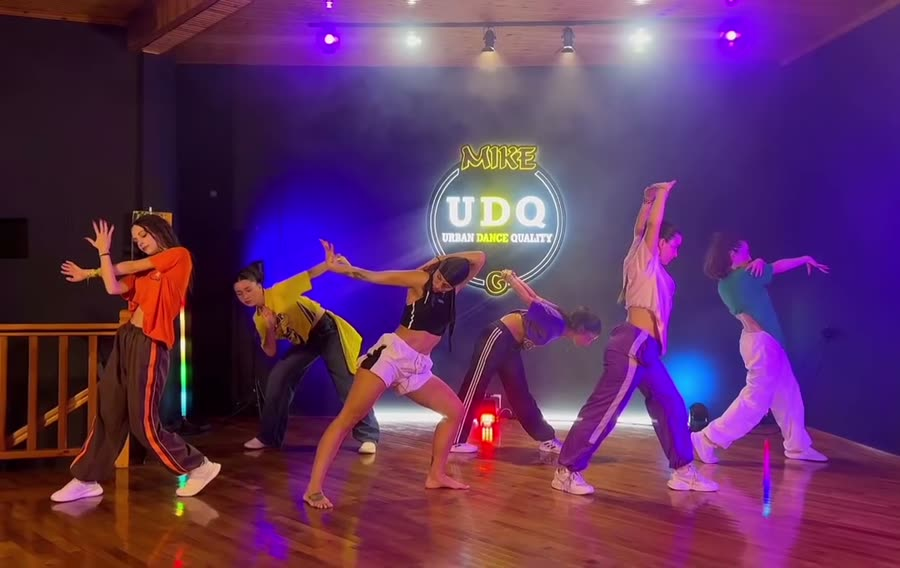
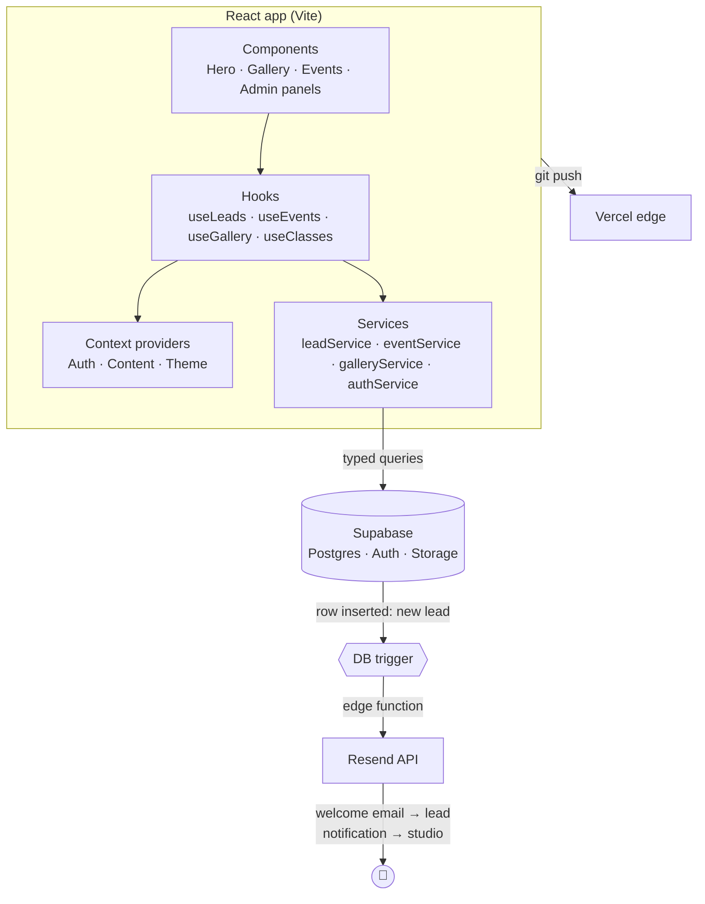
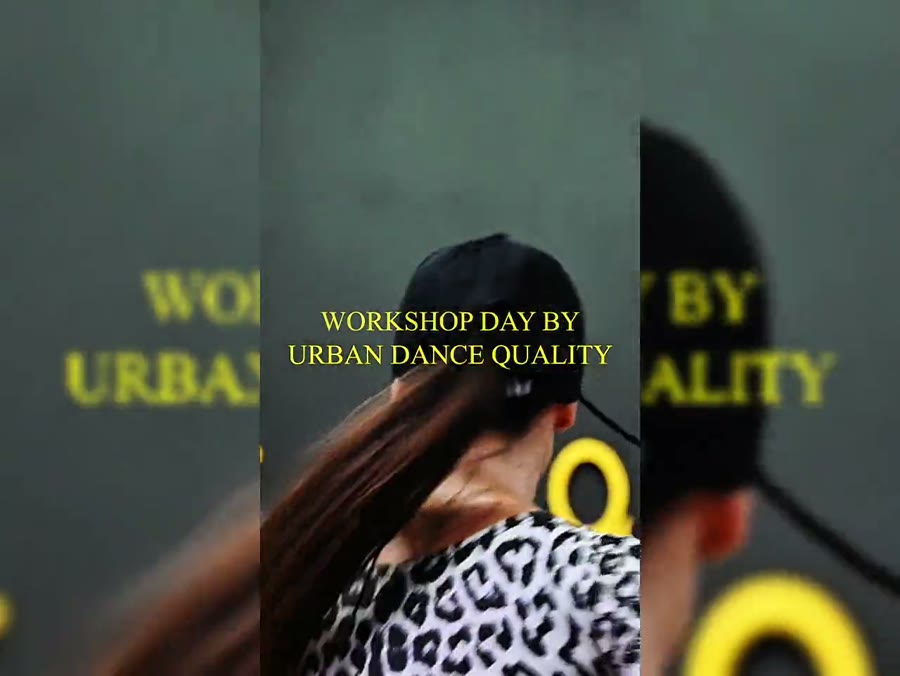

<div align="center">

# Urban Dance Quality — by Mike G

### Case study & technical showcase of a production dance-school website

**Ιωάννινα, Greece · React + TypeScript + Supabase · deployed on Vercel**

[](https://www.urbandancequality.gr/)
&nbsp;


<br/>

<a href="https://www.urbandancequality.gr/">
  
</a>

</div>

> [!NOTE]
> **This is a curated showcase, not the source repository.** It exists so anyone can see
> *how the project was built and the decisions behind it* — architecture, engineering
> choices, and the real problems solved along the way. **No secrets, credentials, or
> verbatim application code are published here.** The full source lives in a private repo;
> the live product is one click away above. 👆

---

## 🩰 What it is

A complete, bilingual-ready marketing + operations website for **Urban Dance Quality**, an
urban dance school in Ioannina founded by **Mike G**. It is not a template — it is a
custom-built product with two distinct sides:

- **The public site** — a fast, dark, brand-forward experience: animated hero reel,
  class catalogue, achievements counters, an events/seminars timeline, a media gallery,
  an interactive map, and a lead-capture form that turns visitors into trial bookings.
- **A private admin CMS** — the studio owner logs in and edits everything (classes,
  coaches, events, achievements, gallery collections) and manages incoming leads, with
  **zero developer involvement** for day-to-day content.

<div align="center">
<br/>



<br/>
<em>Class categories are video tiles on the live site — Breaking · K-Pop · Competition · Dancehall</em>
</div>

---

## 🧱 Tech stack

| Layer | Choice | Why |
|---|---|---|
| **UI** | React 18 + TypeScript | Component model + type safety across a large surface |
| **Build** | Vite 5 | Instant HMR, tiny config, fast production builds |
| **Styling** | Tailwind CSS 3 (semantic design tokens) | Utility speed *without* hard-coded colors — see below |
| **Motion** | Framer Motion | Hero reel, scroll reveals, marquee strips |
| **Routing** | React Router 6 (lazy admin bundle) | Public and admin code split apart |
| **Backend** | Supabase (Postgres + Auth + Storage) | DB, row-level security, auth and media in one |
| **Email** | Resend, triggered from Postgres | Transactional lead emails without a server |
| **Maps** | Leaflet + React-Leaflet | Lightweight, no API-key vendor lock-in |
| **Hosting** | Vercel | Git-push deploys, global edge, automatic HTTPS |

---

## 🏗️ Architecture

The frontend is layered so that **UI never talks to the database directly**. Every data
path flows through a thin service, is wrapped by a hook, and is shared through context.
That separation is what makes the admin CMS and the public site reuse the same data
safely.



**Folder shape (private repo):**

```
src/
├── components/
│   ├── frontend/   # Hero, EventsSection, GalleryGrid, RegistrationForm, VideoWall…
│   ├── admin/      # LeadsPanel, ContentEditor, CollectionManager…
│   ├── layout/     # Navbar, Footer, MenuOverlay, Layout
│   └── common/     # Button, Modal, Spinner, SectionHead…
├── services/       # DB access boundary — one file per domain
├── hooks/          # useLeads, useEvents, useGallery, useSubmitLead…
├── context/        # Auth / Content / Theme providers
├── config/         # theme tokens, gallery manifest, constants
├── utils/          # validators, honeypot, formatters
├── pages/          # public pages + admin/ (lazy-loaded)
└── routes/         # AppRouter, ProtectedRoute, ScrollToTop
```

---

## ✨ Feature highlights

- **Owner-editable CMS** — classes, coaches, events, achievements and gallery collections
  are all edited from a protected dashboard; the marketing site reads the same records.
- **Lead capture → automatic email** — a trial-booking form writes a lead to Postgres; a
  database trigger fires a Resend email (welcome to the lead, notification to the studio)
  with **no backend server to run or pay for**.
- **Anti-spam by design** — a hidden honeypot field plus client-side validation stop bots
  before a row is ever written.
- **7-category media gallery** — performances, seminars, competitions, talent, the space,
  video classes and video projects, each with its own compressed media set.
- **SEO & social ready** — canonical host, Open Graph + Twitter cards, `DanceSchool`
  structured data (schema.org), sitemap and geo meta for local search in Ioannina.
- **Mobile-first, motion-rich, accessible** — reduced-motion support, visible focus rings,
  no horizontal scroll, and a hard-locked dark brand theme (story below).

<div align="center">
<br/>



<br/>
<em>From the live gallery — performances · the studio space · seminars</em>
</div>

---

## 🔧 Engineering decisions & problems solved

This is the *"how I moved"* part — real calls made during the build, and a few bugs that
were genuinely interesting to chase down.

### 1. Semantic color tokens instead of hard-coded colors
Every color is a CSS variable exposed to Tailwind as a role (`bg`, `surf`, `ink`, `yel`…),
not a literal. Components ask for a **role**, never a hex. Swapping the entire palette is a
matter of changing variables in one place — no component knows or cares.

```css
:root {
  --c-bg:  11 11 11;   --c-ink: 245 245 243;
  --c-surf: 20 20 20;  --c-yel: 255 214 10;   /* the brand gold */
}
/* tailwind.config → colors: { yel: "rgb(var(--c-yel) / <alpha-value>)" } */
/* usage → class="bg-bg text-ink border-yel/40"  */
```

### 2. The "why is it brown on their phones?" bug 🕵️
The site is designed **dark-only** (black + gold). The theme originally followed the
device's `prefers-color-scheme`. On the developer's devices (always dark mode) it looked
perfect — gold on black. But on a visitor's phone in **light mode**, the never-finished
light palette kicked in: dark text on the dark fixed background photo blended into a muddy
**brown**. Because the choice was cached per-device in `localStorage`, it showed up
intermittently and looked like it "changed on its own."

**Fix:** since there's no theme switch in the UI, the site is now **locked to dark** for
everyone — ignoring both the OS setting and any stale cached value — so every visitor sees
the same intended black-and-gold.

```tsx
// The whole product is dark by design; lock it and ignore the device.
const theme = "dark";
useEffect(() => {
  document.documentElement.setAttribute("data-theme", "dark");
  localStorage.setItem("udq-theme", "dark");
}, []);
```
> Lesson: an unfinished "second theme" wired to a system preference is a landmine —
> it stays invisible until the first visitor whose device flips the switch.

### 3. Zoom vs. smooth scrolling
Desktop renders at `zoom: 0.75` for density, but that global zoom **breaks JS smooth
scrolling** (target offsets get miscomputed). Anchor navigation was switched to instant,
synchronous scrolling so it lands on the right section every time.

### 4. Mobile renders at 100%, desktop at 75%
The `zoom` trick that tightens desktop made **mobile fonts tiny and left a huge hero gap**.
Zoom is now scoped to `min-width: 768px` only, so phones render at true 100% with correct
type sizes and viewport units.

### 5. www canonical & the Google "globe" favicon
Non-www 308-redirects to www on Vercel, but canonical/OG/sitemap all still pointed at the
non-www host. That mismatch (a canonical URL that redirects elsewhere) broke Google's
favicon association. Aligning **every** declared URL to the host that actually serves `200`
fixed it.

### 6. Media pipeline: ship small, keep originals
Raw photos/videos live outside the app; a compression step produces web-optimized versions
into per-category folders, and hero videos were compressed to cut **~75 MB** off the
payload. The gallery reads a manifest so adding media is a content task, not a code change.

---

## ⚡ Performance & quality floor

- Code-split admin bundle — visitors never download the CMS.
- Compressed imagery and video; poster frames for every reel.
- `prefers-reduced-motion` fully honored; keyboard focus always visible.
- Security headers (HSTS, `X-Content-Type-Options`, `Referrer-Policy`, frame options).
- Type-checked build (`tsc -b`) gates every deploy.

---

## 🚀 How it ships

```text
git push  →  Vercel builds (tsc -b && vite build)  →  global edge deploy  →  https://www.urbandancequality.gr
```

Content changes never touch this pipeline — the owner edits through the admin CMS and the
public site reflects it immediately from Supabase.

---

<div align="center">

### 👉 See the real thing: **[urbandancequality.gr](https://www.urbandancequality.gr/)**

<sub>Built for Urban Dance Quality by Mike G · showcase repository · full source & credentials kept private</sub>

</div>
